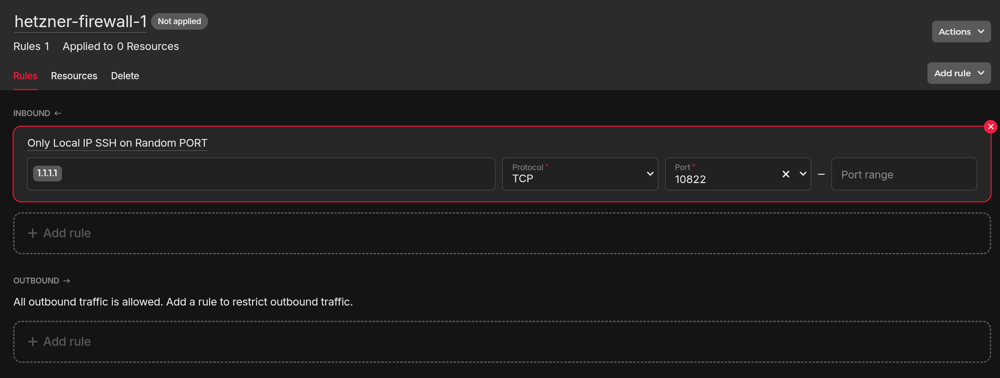
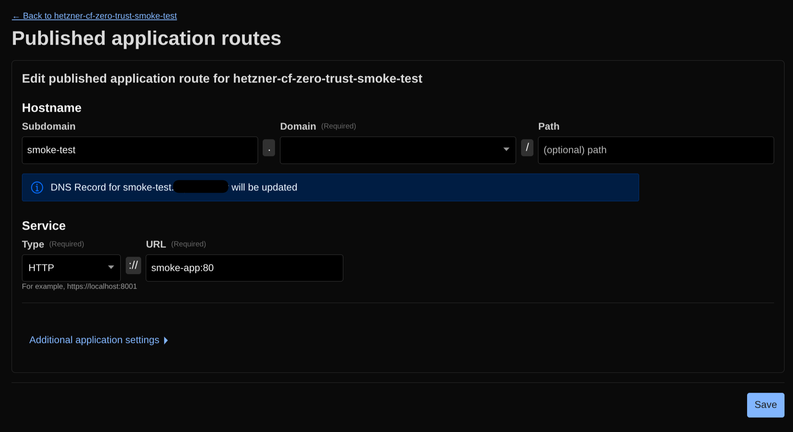
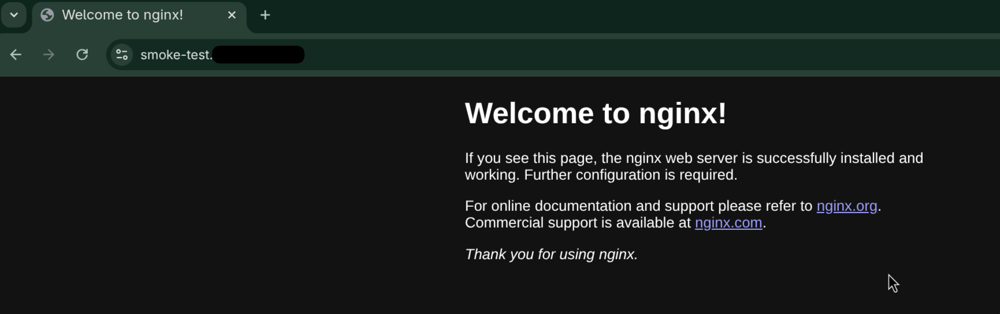

# | ☁ HETZNER | 🦅 IaCarus

From repo root: `cd hetzner`.

### make vps-new

`make vps-new` will **automatically provision a new server**.
It simple runs the `iacarus/hetzner/vps-provision.sh` script.

The server’s configuration is defined in: `iacarus/config.sh`:

```sh
# --- HETZNER VPS CONFIG ---

VPS_BASE_NAME="hetzner-vps-"
VPS_TYPE="cax11"
VPS_LOCATION="hel1"
VPS_IMAGE="ubuntu-24.04"
ENVIRONMENT="development"
VPS_ADMIN_USER="hzr-user"
```

> TODO: include a tutorial to create a Hetzner Account with multiple
> Project > Tokens > Contexts

A new server will be created on the project defined by your `hcloud` token/context.

```sh
iacarus/hetzner main ❯ make vps-new
🔍 Checking Pre-requisites...
🖥  Target: hetzner-vps-1 | Port: ***22 | Region: hel1
☁️ Calling Hetzner API...
 ✓ Waiting for create_server       100% 19s (server: ***1012, image: 161547270)
 ✓ Waiting for start_server        100% 19s (server: ***1012)
Server ***1012 created
IPv4: <IPv4-IP>
IPv6: <IPv6-IP>
IPv6 Network: <IPv6-Network>::/64
Root password: ***
✅ Server Created: <IPv4-IP>
📝 Updating ~/.ssh/config...
⏳ Waiting for SSH (approx 45s)...
................
⇄  Port ***22 is open!
Stabilizing connection...
🔑 Registering SSH Keys...
------------------------------------------------
🎉 DEPLOYMENT COMPLETE!
   It s strongly advised that you setup a Hetzner Firewall allowing ONLY the SSH PORT: ***22
   Login: ssh hetzner-vps-1
------------------------------------------------
```

All SSH config is also automatically done, meaning `~/.ssh/config` file and
`~/.ssh/known_hosts` file are backed-up and changed.

```sh
iacarus/hetzner main ❯ cat ~/.ssh/config
# (...)
# Auto-generated by Hetzner IaCarus (2025-12-02)
Host hetzner-vps-1
  HostName <IPv4-IP>
  User hzr-user
  Port ***22
  IdentityFile ~/.ssh/key-name
# (...)
```

```sh
iacarus/hetzner main ❯ cat ~/.ssh/known_hosts
# (...)
[<IPv4-IP>]:***22 ssh-rsa AAAAB3NzaC1y***
[<IPv4-IP>]:***22 ecdsa-sha2-nistp256 AAAAE2VjZHNhLXNoYTItb***
[<IPv4-IP>]:***22 ssh-ed25519 AAAAC3NzaC1***
# (...)
```

It's advised that you create/setup a Hetnzer Firewall (it's free!), with **ONLY**
one inbound rule, allowing connection **ONLY** from your "local IP"
to the generated server SSH PORT.



### make vps-list

`make vps-new` will list all VPS created on the project defined
by your `hcloud` token/context.

```sh
iacarus/hetzner main ❯ make vps-list
🔍 Fetching server list...
ID          NAME            IPV4           DATACENTER   STATUS
***2949     hetzner-vps-1   <IPv4-IP>      hel1-dc2     running
```

### make vps-down

`make vps-down` will destroy a selected VPS.
It simple runs the `iacarus/hetzner/vps-destroy.sh` script.

This script has a "Safety Lock" so that you need to type the VPS name
you're trying to destroy.

Also, it removes the configuration from `~/.ssh/config` file and `~/.ssh/known_hosts`.

```sh
iacarus/hetzner main ❯ make vps-down
🔍 Checking Pre-requisites...
🔍 Fetching server list from Hetzner...
Select a server:
1) ***785:hetzner-vps-2:<IPv4-IP>:running
Enter number (or 'q' to quit): 1

Selected: hetzner-vps-2 (<IPv4-IP>)
⚠️ WARNING: DESTRUCTIVE ACTION
>  Type 'hetzner-vps-2' to confirm: hetzner-vps-2
🔥 Destroying hetzner-vps-2...
 ✓ Waiting for delete_server       100% 10s (server: ***785)
Server ***785 deleted
📝 Removing entry from /home/filipe/.ssh/config...
🧹 Cleaning known_hosts (IP: <IPv4-IP> | Port: ***22)...
✅ hetzner-vps-2 has been obliterated.
```

### make vps-check-heath

`make vps-check-heath` will run the `iacarus/hetzner/vps-health-check.sh` script.

The script will check several configurations that we "ask" Hetzner to do through
the config file `./vps-user_data.yml.template`.

- Check `cloud-init` status.
- Check if the user has permission to run Docker.
- Check if the server internal firewall `ufw` is:
  - running,
  - allowing only 22-like ports incoming traffic.
- Check if `fail2ban` is running and prints the `Jails` configured.
- Check the SSH Runtime config:
  - Root Login must be disabled,
  - Pass Auth must be disabled.
- Check SSH config files:
  - Only the `hardening.conf` must be there.
- Check if the server needs a reboot - _a fresh server will always reboot!_

```sh
iacarus/hetzner main ❯ make vps-check-heath
🔍 Fetching server list from Hetzner...
Select a server:
1) ***949:hetzner-vps-1:<IPv4-IP>:running
2) ***785:hetzner-vps-2:<IPv4-IP>:running
Enter number (or 'q' to quit): 2

🔌 Testing connection to hetzner-vps-2... OK

🩺 Starting Health Check on hetzner-vps-2...
----------------------------------------

🔍 1. Cloud-Init Status
✅ Finished.

🔍 2. Docker Permissions
✅ OK (hzr-user).

🔍 3. Firewall (UFW)
✅ Active.
✅ Stealth Mode Verified. (Only *22 ports are open)

🔍 4. Fail2Ban
✅ Running. Jails: sshd

🔍 5. SSH Runtime Config (sshd -T)
   Port: ***22
✅ Root Login Disabled.
✅ Password Auth Disabled.

🔍 6. SSH File Hygiene
✅ Clean. (Only 'hardening.conf' exists)

✅ System is clean (No reboot needed).

----------------------------------------

```

### make vps-smoke-tunnel

This script assume that you've already created a Zero Trust Tunnel for smoke tests
and setup the `CF_TUNNEL_SMOKE_TEST_TOKEN` env variable.

`make vps-smoke-tunnel` will run the `iacarus/hetzner/vps-cf-tunnel-smoke_test.sh` script.

The script will create a Docker bridge network, launch the `cloudflared` tunnel
and a `nginx` container.

```sh
iacarus/hetzner main ❯ make vps-smoke-tunnel
🔍 Checking Pre-requisites...
🔍 Fetching server list from Hetzner...
Select a server:
1) ***949:hetzner-vps-1:<IPv4-IP>:running
2) ***785:hetzner-vps-2:<IPv4-IP>:running
Enter number (or 'q' to quit): 2

🔌 Testing connection to hetzner-vps-2... OK

🌫️  Starting Smoke Test on 'hetzner-vps-2'...
----------------------------------------
1. Creating Docker Network (net-smoke)...
93c59818433e3d327a3ea26b4731b19414ce7b48664a788a89ad31247c139418
2. Starting Fake App (Nginx)...
Unable to find image 'nginx:alpine' locally
alpine: Pulling from library/nginx
6b59a28fa201: Pulling fs layer
2bc0551b3285: Pulling fs layer
...
Digest: sha256:b3c656d55d7ad751196f21b7fd2e8d4da9cb430e32f646adcf92441b72f82b14
Status: Downloaded newer image for nginx:alpine
3. Starting Tunnel...
Unable to find image 'cloudflare/cloudflared:latest' locally
latest: Pulling from cloudflare/cloudflared
44d654bc6e99: Pulling fs layer
bfb59b82a9b6: Pulling fs layer
...
Digest: sha256:89ee50efb1e9cb2ae30281a8a404fed95eb8f02f0a972617526f8c5b417acae2
Status: Downloaded newer image for cloudflare/cloudflared:latest

✅ Simulation Running!
   App:     smoke-app
   Tunnel:  smoke-tunnel
   Network: net-smoke
----------------------------------------
⚠️ ACTION REQUIRED ON CLOUDFLARE:
1. Zero Trust -> Tunnels -> Configure -> Public Hostname
2. Service Type: HTTP
3. URL: http://smoke-app:80

🌍 Check your browser. Do you see Nginx?
Press [Enter] to clean up and destroy test...
```

> TODO: include a tutorial to create a `cloudflared` Tunnel.

After that a message will pops up asking you to setup a route to reach the
`nginx` app trough the `cloudflared` tunnel.



If everything ran smoothly, you might see it accessing you configured (sub)domain.



Hitting `Enter` and all smoke test resources, will be destroyed.

```sh
----------------------------------------
⚠️  ACTION REQUIRED ON CLOUDFLARE:
1. Zero Trust -> Tunnels -> Configure -> Public Hostname
2. Service Type: HTTP
3. URL: http://smoke-app:80

🌍 Check your browser. Do you see Nginx?
Press [Enter] to clean up and destroy test...
🧹 Cleaning up...
smoke-tunnel
smoke-app
net-smoke
✅ Cleaned up!
```
